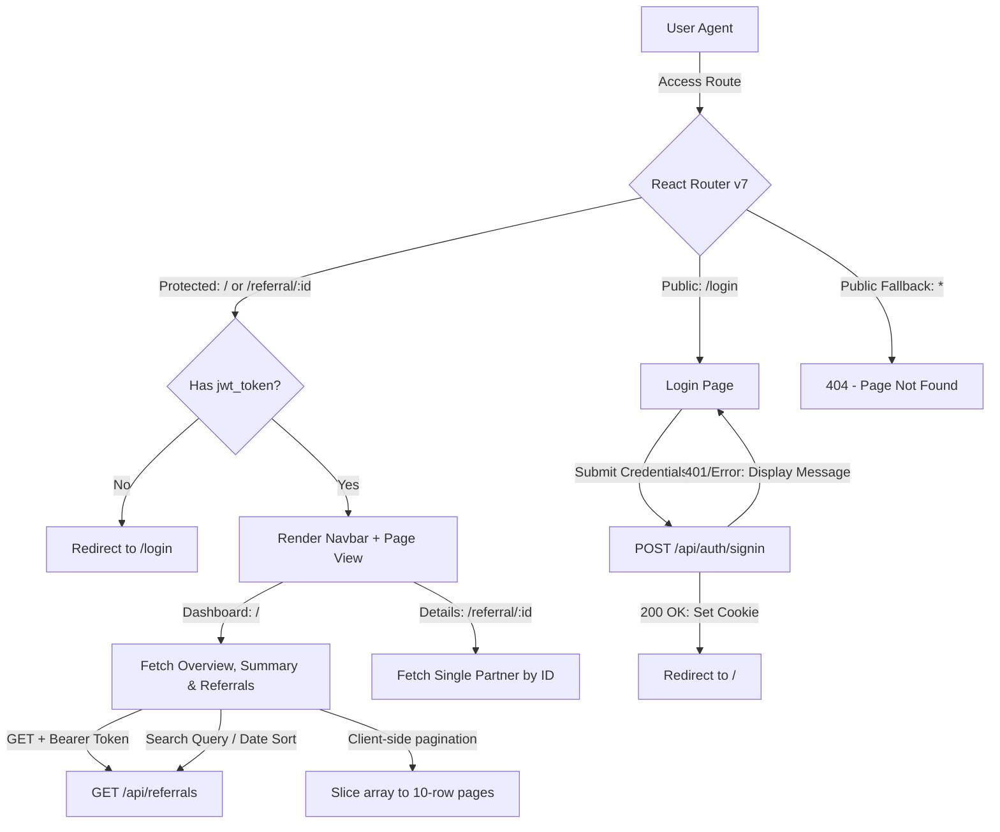

# Go Business — Referral Dashboard
An enterprise-grade, secure, and responsive referral management portal built for Go Business with " AWS " api endpoints references. This web application tracks partner referrals, service breakdowns, total earnings, and shareable referral links/codes.

---

## System Flow & Architecture

Below is the high-level architecture diagram detailing the user session flow, route protection guards, and backend API interactions:



---

## Technology Stack & Design Systems

*   **Core Engine**: React 19 (scaffolded via Vite)
*   **Routing**: React Router v7 (declarative route hierarchies)
*   **Session Management**: JS Cookie (local storage container validation)
*   **UI Components & Icons**: Lucide React
*   **Styling**: Vanilla CSS (Slate & Indigo system)
    *   Responsive layouts (flexbox grids, media queries)
    *   Premium shadows (`--shadow-lg`, `--shadow-glow`)
    *   System font families (`Outfit` & `Inter`)
    *   Glassmorphism card interfaces
    *   Automatic light/dark mode styling

---

## Design Patterns & Implementation Choices

### 1. Route Security Guards (`src/components/ProtectedRoute.jsx`)
Authenticates requests before rendering protected layouts. Redirects to `/login` if `jwt_token` is not found. Similarly, redirects authenticated users visiting `/login` back to the home page `/`.

### 2. Debounced API Requests
To avoid unnecessary network traffic when typing in the search box, the search query is debounced for `300ms` before triggering a new GET request:
```javascript
useEffect(() => {
  const delayDebounce = setTimeout(() => {
    fetchData(searchQuery, sortOrder);
  }, 300);
  return () => clearTimeout(delayDebounce);
}, [searchQuery, sortOrder]);
```

### 3. Client-Side Pagination
Since the REST API returns the entire filtered list of referrals, client-side slicing is handled dynamically. The page resets to `1` automatically on any new search filter or sorting change:
```javascript
const ITEMS_PER_PAGE = 10;
const from = totalEntries === 0 ? 0 : (currentPage - 1) * ITEMS_PER_PAGE + 1;
const to = Math.min(currentPage * ITEMS_PER_PAGE, totalEntries);
const paginatedReferrals = referrals.slice(from - 1, to);
```

### 4. Robust Response Parser
Handles structural variations in the response, supporting both nested data nodes and flat models to ensure deep links always load successfully:
```javascript
const parsedData = responseJson.data || responseJson || {};
const referralsList = parsedData.referrals || [];
```

---

## Getting Started

### Prerequisites
*   Node.js (LTS v18.x or v20.x recommended)
*   npm (v9.x or above)

### Installation
1.  Clone the repository and navigate into the folder:
    ```bash
    git clone https://github.com/gobinath-sketch/GoBusiness.git
    cd GoBusiness
    ```
2.  Install dependencies:
    ```bash
    npm install
    ```

### Running the App
*   Start the local development server:
    ```bash
    npm run dev
    ```
    Once started, navigate to the local server URL (usually `http://localhost:5173/`).

*   Compile a production build bundle:
    ```bash
    npm run build
    ```
    Build artifacts will compile inside the `./dist/` directory.

*   Preview the production build locally:
    ```bash
    npm run preview
    ```

---

## API Reference

### REST Endpoints
*   **Auth URL**: `https://-------------north-1.amazonaws.com/api/auth/signin`
*   **Referrals URL**: `https://---------------north-1.amazonaws.com/api/referrals`
    *   *Search Param*: `?search=<name_or_service>`
    *   *Sort Param*: `?sort=asc|desc` (default `desc`)
    *   *Single Item Param*: `?id=<referral_id>`
